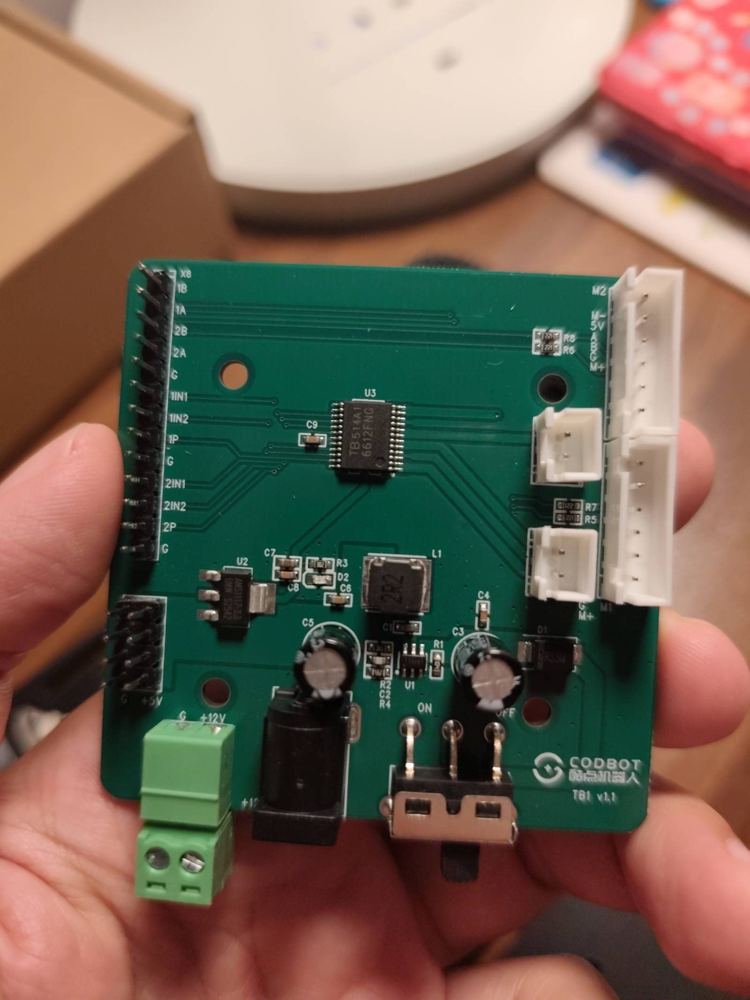
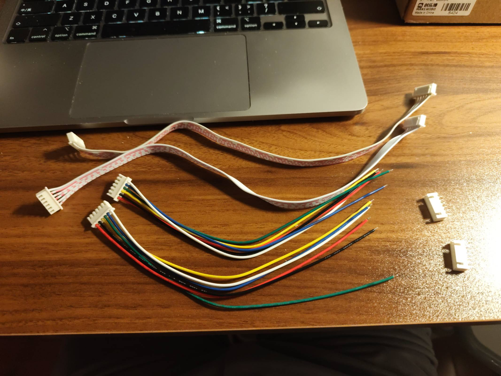
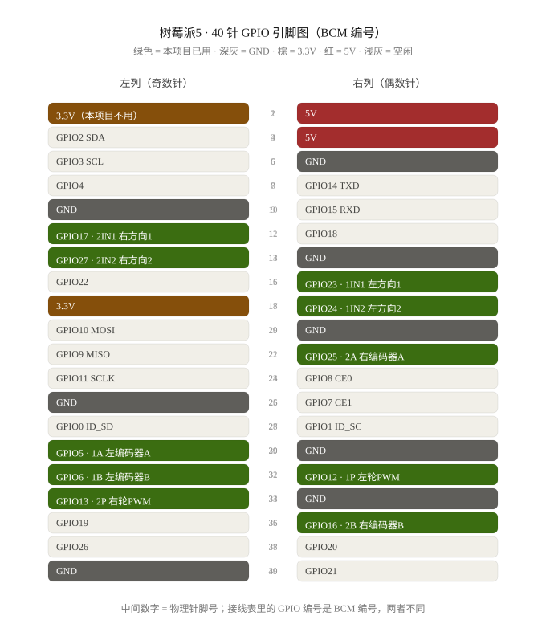
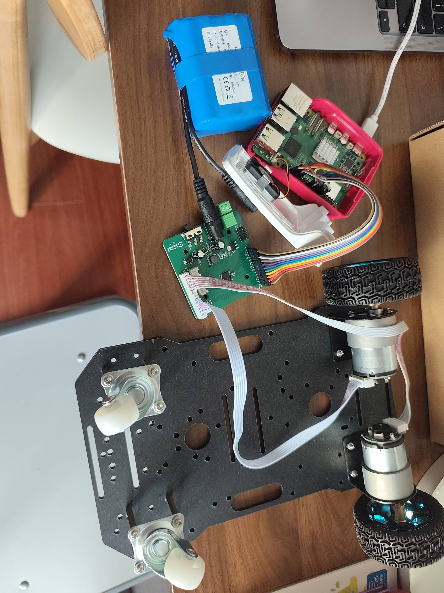

# 05-接线与调试手册-v1

> 机械：底盘 + 520 编码电机 ×2 + 65mm 轮 ×2 + 双万向轮 ✅（2026-09-26 实拍确认）  
> 本手册覆盖：机械收尾 → TB6612 接线 → 三个递进测试。

---

## 一、机械收尾（装电控前）

1. **上层板装上**：层间用 M3 铜柱（含在底盘清单里）撑起第二层板。
2. **树莓派固定到上层板**：用 **M2.5 尼龙柱 + 尼龙螺丝**（四角 58×49mm 孔距）。⚠️ 用尼龙不用金属——金属柱可能顶到主板背面元件造成短路。
3. **TB6612 固定**：M3 铜柱/螺丝锁在上层板，放在方便接电机线的边缘位置；**XH2.54 编码电机插头朝向板边**。
4. **电池固定**：魔术贴绑在**底层板中间**（重心低、两轮中间最好），船型开关装在容易够到的位置。
5. **走线**：两个电机的 XH 插头线从底层板**中心大孔**穿到上层；线留一点余量但不悬垂。
6. **保险丝**：电池 **正极 → 3A 保险丝 → TB6612 的 VM**。这是防堵转烧板的最后一道防线，别省。

## 二、接线表（按酷点 TB1 实物板更新，BCM 编号）



> 实物为集成板：TB6612 + 5V 稳压 + DC 座 + ON/OFF 开关二合一。  
> **左侧长排针 = 控制与编码器信号；右侧两个 6P 白色座 = 电机+编码器一线通（M1/M2）；左下绿色端子 = 电池输入；板边开关 = 电源开关。**

**① 电机 → 板（用随板附赠的延长排线，仍然免焊接）**



| 电机        | 插到板上                         | 说明                          |
| --------- | ---------------------------- | --------------------------- |
| 左电机 6P 插头 | 6P-6P 延长排线 → **M1 六针白座**（右下） | 电机在下层、板在上层，直插够不着，**用排线延长**  |
| 右电机 6P 插头 | 6P-6P 延长排线 → **M2 六针白座**（右上） | 丝印 M- / 3V / B / A / G / M+ |

> - 延长排线**没有防呆方向时注意对齐丝印**：插头凸扣朝向与板上座子一致，**M-/M+ 对 M-/M+**（排线两端的线序一般是直通的，插之前顺一遍线色确认没镜像）。
> - 左右插反不用重插，代码里对调即可。
> - **6P 转散线 ×2 和备用 XH 壳 ×2 先收着**：以后接传感器、外引编码器或做航插时用，本阶段用不上。

**② 板 → 树莓派（母对母杜邦线，共 11 根）**



> 树莓派板上的丝印是**物理针脚号**（1–40），代码和本表用的是 **BCM 编号**——对照上图中间的数字找针。本项目用到的物理针脚：**6 或 9**(GND，任选)、**11**(GPIO17)、**13**(GPIO27)、**16**(GPIO23)、**18**(GPIO24)、**22**(GPIO25)、**29**(GPIO5)、**31**(GPIO6)、**32**(GPIO12)、**33**(GPIO13)、**36**(GPIO16)。红色 5V（针 2/4）和 3.3V（针 1）一根都不接。

> **排针实测共 13 针（2026-09-26 用户实数）。** 从板角那端数：`1B(1) 1A(2) 2B(3) 2A(4) G(5) 1IN1(6) 1IN2(7) 1P(8) G(9) 2IN1(10) 2IN2(11) 2P(12) G(13)`，最靠近绿色端子的是 G（电池/板 GND）。编码器供电由板上 3V（6P 座内）提供。  
> ⚠️ **上电后先测 3V**：只接电池，万用表量 M1 座 **3V 针对地**——约 3.3V 则一切安全；**若是 5V**，编码器输出会超 GPIO 耐压，先别把编码器线接进树莓派，联系卖家确认或加电平转换。

| 板左侧排针（按丝印，从板角端数起） | 树莓派 GPIO（BCM） | 说明           |
| ----------------- | ------------- | ------------ |
| 1B                | **GPIO6**     | 左轮编码器 B 相    |
| 1A                | GPIO5         | 左轮编码器 A 相    |
| 2B                | GPIO16        | 右轮编码器 B 相    |
| 2A                | **GPIO25**    | 右轮编码器 A 相    |
| G                 | **GND**（物理针 6/9 任选） | **共地线：三颗 G 内部相通，接任意一颗到树莓派 GND 即可，必须接！** |
| 1IN1              | GPIO23        | 左轮方向 1       |
| 1IN2              | GPIO24        | 左轮方向 2       |
| **1P**            | **GPIO12**    | 左轮速度（硬件 PWM） |
| G                 | —（内部相通，无需再接） |              |
| 2IN1              | GPIO17        | 右轮方向 1       |
| 2IN2              | GPIO27        | 右轮方向 2       |
| **2P**            | **GPIO13**    | 右轮速度（硬件 PWM） |
| G                 | —（内部相通，无需再接） |              |

> 三颗 G 在板上内部连通，都是同一块地。**接 1 根到树莓派 GND 就够**（杜邦线总数 11 根 = 共地 1 + 方向 4 + PWM 2 + 编码器 4）；剩下两颗 G 空着，它们同时是电池负极的回路（电池 − 接绿端子 G 时全板共地）。

- 板上没有 STBY 引脚——板内已拉高，不用接。若首次上电电机自己转，立即断电拍图给我。
- 编码器信号经 1A/1B/2A/2B 从排针引出（6P 座里那几针不用自己接）。
- 左下角还有一个小的 **G / 5V 排针**：板载稳压输出，只许带小外设（舵机/传感器），**永远别给树莓派供电**。

**③ 电源**

| 连接                                 | 说明                             |
| ---------------------------------- | ------------------------------ |
| 电池 + → **保险丝(3A)** → 绿色端子 **+12V** | 也可插板上 DC 座（5.5×2.1），二选一        |
| 电池 − → 绿色端子 **G**                  |                                |
| 板上 **G ↔ 树莓派 GND**                 | **必须共地！** 不共地 = 电机乱转/不转，新手第一大坑 |
| ON/OFF 拨动开关                        | 板载电源总开关，**不用再买船型开关了**          |
| 树莓派 USB-C                          | 仍走 27W 官方电源（台架）/ 电池+降压（装车后）    |

**④ 接线完成实拍（2026-09-27）**



对照检查要点：

- 树莓派排针 → 板左侧排针的**杜邦排线一束**（共地 1 + 方向 4 + PWM 2 + 编码器 4 = 11 根）
- 电池 → 板上 DC 座/绿端子（**正极回路串 3A 保险丝**，图里若还没串，装车前补上）
- 两根 **6P 延长排线**从板上 M1/M2 座下到下层板，接左右电机
- 走线避开车轮和万向轮活动范围，线不悬垂、不卡传动

## 三、上电前检查清单

- [ ] VM 正负极没接反（接反 = TB6612 立即报废，保险丝救不回来）
- [ ] 三处 GND 连通（电池−、板上 G、树莓派 GND）
- [ ] **轮子悬空**（把车架起来/垫高，第一次通电别让车跑）
- [ ] 板上 G 与树莓派 GND 之间那根共地线已插
- [ ] （接编码器前）实测 6P 座 3V 对地 ≈3.3V

**上电/断电顺序**（为什么见下）：

```
上电：① 树莓派插 27W 电源（先让它启动、GPIO 进入确定状态）
      ② 打开板上 ON/OFF 开关（电池→驱动板）
断电：① 先关板上 ON/OFF 开关（电机断电）
      ② 再让树莓派软关机 sudo poweroff，红灯常亮后拔电源
```

## 四、三个递进测试

把 `code/` 目录下的脚本传到树莓派（或直接 `scp -r code pi:/home/xjs/`），依次跑：

### 测试 1：轮子转起来（`01_motor_test.py`）

```bash
python3 ~/code/01_motor_test.py
```

两轮依次前进/后退各 2 秒，速度渐变。**不转或一个转一个不转 → 优先查方向脚接线；转向相反 → 对调该电机 AIN1/AIN2（或 BIN1/BIN2）两根线。**

### 测试 2：编码器读数（`02_encoder_test.py`）

```bash
python3 ~/code/02_encoder_test.py
```

先**用手转轮子**，屏幕应打出每秒脉冲数；再跑电机，两轮数值应接近。**某一路恒为 0 → 编码器供电没接好或 A 相线松；数值乱跳 → 检查 GND。**

### 测试 3：走直线（开环对比后再 PID，`03_drive_straight.py`）

```bash
python3 ~/code/03_drive_straight.py
```

先用相同 PWM 走 2 秒看偏移（开环必然略偏，属正常）；之后进 PID 阶段，用两轮编码器里程差闭环修正。PID 参数从 `Kp=0.5, Ki=0, Kd=0` 开始慢慢加。

### 红线（贯穿所有测试）

1. **堵转保护**：PWM 给满但编码器 500ms 无脉冲 → 立即断电（脚本里已内置思路，PID 阶段正式加入）。
2. 调试时**别让车顶着墙跑**：520 电机堵转 3.5A > TB6612 峰值 3.2A。
3. 关车流程：代码停 → `sudo poweroff` → 绿灯灭 → 断电池开关。

## 五、装车后（第二批前的临时方案）

台架期间树莓派用 27W 电源；想下车跑短途，可用「电池 + 12V转5V 降压（≥5A）→ USB-C」。降压模块还没买，放进第二批。
